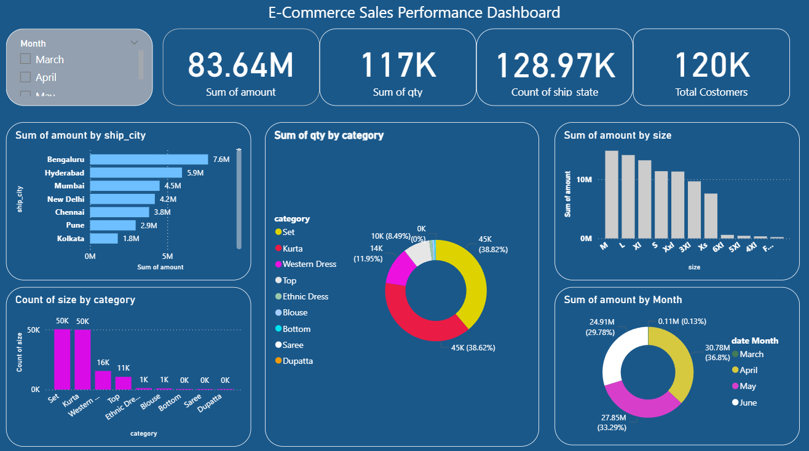

#  E-Commerce Fashion Sales Analysis Dashboard

This project is a complete **E-commerce sales risk and performance analysis** using **Power BI**. It provides clear insights into customer behavior, sales trends, and business performance using visual storytelling.

##  Project Files

- `E-commerce_Sales_Optimized.csv`: Cleaned dataset under 5MB for GitHub compatibility.
- `E-Commerce_Dashboard.pbix`: Power BI report file with interactive visuals.

## 📊 Features of the Dashboard

- Sales performance by region, currency, and fulfillment channel
- Quantity sold and transaction analysis
- Postal code-wise shipping insights
- B2B vs B2C order distribution
- Clean and user-friendly visual layout

##  Data Cleaning & Optimization

- Removed large text-heavy columns for GitHub limit
- Optimized the dataset to be under 5MB
- Retained essential columns for analytics:
  - `Qty`, `currency`, `Amount`, `ship-postal-code`, `B2B`, `fulfilled-by`

##  Tools Used

- **Power BI**: For designing the interactive dashboard
- **Python & Pandas**: For data preprocessing and file optimization

##  How to Use

1. Clone or download the repository.
2. Open `E-Commerce_Dashboard.pbix` using Power BI Desktop.
3. Load the `E-commerce_Sales_Optimized.csv` file when prompted.
4. Explore insights and customize visuals as needed.

##  Future Improvements

- Add time-based trends if date columns are available
- Include customer segmentation and predictive insights
- Integrate with live data sources for real-time analytics

##  Contact

For questions or collaborations, feel free to connect:
  
Sakthi Kumar B

Email: b.sakthikumar10@gmail.com  

LinkedIn: [linkedin.com/in/sakthikumar1](https://www.linkedin.com/in/sakthikumar1)  
 
GitHub: [github.com/sakthikumar-1](https://github.com/sakthikumar-1)

---

⭐ Star this repo if you found it useful!
